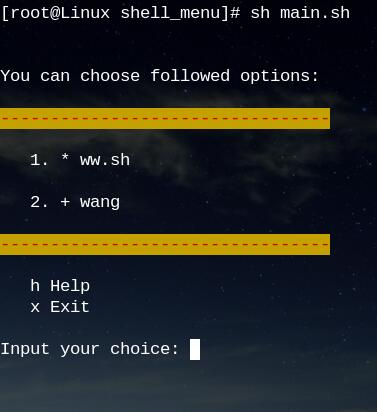

## shell_menu

Shell_menu 是一个框架

> * 自动生成脚本菜单
> * 统一管理脚本工具
> * 日常运维工具
>   * Pip 
>   * Redis



* 上图输入 1 ，即执行 ww.sh 脚本
* 上图输入 2 ，及进入 wang 目录，程序会判断是否在子目录，如果是在子目录，会自动加回退到上级目录选项
* 本程序仅支持二级菜单
* 如果输入中有字符输入错误，可以输入'Ctrl + Backspace' 进行删除操作
* 添加脚本后可以通过bash main.sh -c 手动更新菜单，以及 bash main.sh -t 查看菜单

## 使用手册

[使用手册](https://github.com/BillWang139967/shell_menu/wiki)

## 版本发布

* v1.0.6，2017-09-16，更新：主程序支持软链接
* v1.0.5，2017-06-09，更新：更换目录时，程序会自动更新脚本菜单，无需手动更新菜单
* v1.0.4，2017-04-04，更新：生成菜单时自动排序
* v1.0.3，2017-03-27，更新：修复多个二级子菜单时生成多个一级菜单情况
* v1.0.2，2016-10-21，更新：支持自动生成二级菜单，目录结构调整
* v1.0.1，2016-08-12，新增：发布初始版本。

## 参加步骤

* 在 GitHub 上 `fork` 到自己的仓库，然后 `clone` 到本地，并设置用户信息。
```
$ git clone https://github.com/BillWang139967/shell_menu.git
$ cd shell_menu
$ git config user.name "yourname"
$ git config user.email "your email"
```
* 修改代码后提交，并推送到自己的仓库。
```
$ #do some change on the content
$ git commit -am "Fix issue #1: change helo to hello"
$ git push
```
* 在 GitHub 网站上提交 pull request。
* 定期使用项目仓库内容更新自己仓库内容。
```
$ git remote add upstream https://github.com/BillWang139967/shell_menu.git
$ git fetch upstream
$ git checkout master
$ git rebase upstream/master
$ git push -f origin master
```
## 小额捐款

如果你觉得 shell_menu 对你有帮助，可以对作者进行小额捐款（支付宝）


